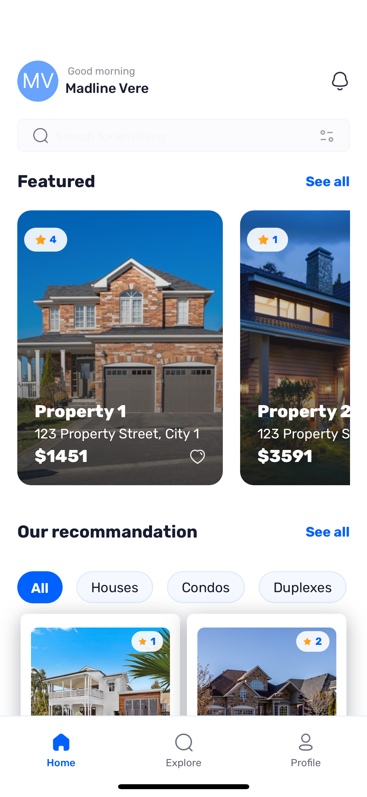
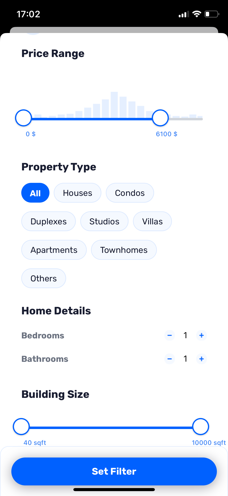
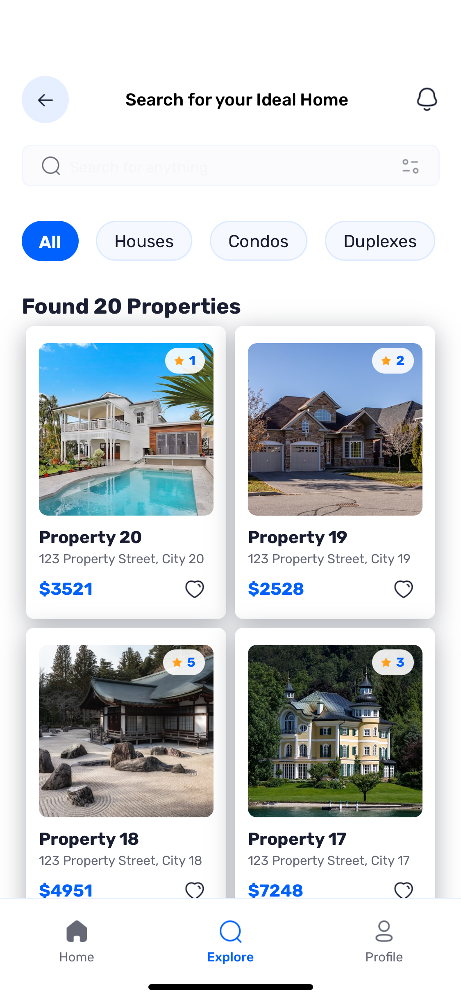

# 🏠 Real Estate Scout - Property Rental App  

  
  
  

A React Native mobile app for browsing and filtering real estate listings, powered by Appwrite backend.

  
    
  

## ✨ Key Features

- 🔍 **Property search** with dynamic suggestions
- 🎚 **Advanced filters**:
  - Property name
  - Bedrooms (1-5+)
  - Bathrooms 
  - Price range (slider)
  - Square footage
  - Property type (House, Apartment, etc.)
- 🔐 **Authentication**:
  - Google Sign-In
- 🔄 **Appwrite integration** for data management

## 🎨 Original Design

Based on Figma mockups:  

## 🛠 Tech Stack

**Frontend**:  
- React Native CLI  
- React Navigation 6  
- Context API (state management)  
- Custom UI components  
- Google Sign-In  

**Backend**:  
- Appwrite (Database, Storage, Authentication)  
- JavaScript SDK  

## 📈 Roadmap

- [ ] Apple Account Sign-In
- [ ] User authentication system
- [ ] Favorites/bookmark system
- [ ] Enhanced image gallery
- [ ] In-app messaging
- [ ] Performance optimizations
